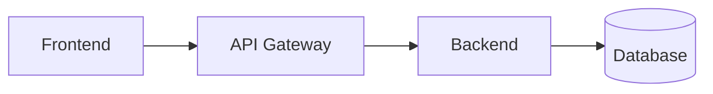

# Markdoc Reference — Tecnología Morelos

Complete reference for Markdoc components supported by the TM renderer.

## The #1 Rule

**Code blocks (triple backtick) must be OUTSIDE ``, ``,
and ``.** Only `` accepts code blocks inside.

**Mermaid diagrams must be OUTSIDE any Markdoc component.**

Violating these rules BREAKS the renderer silently — content may not display.

---

## Components

### Accordion

Collapsible section. Only text and inline code inside.

**Correct:**
```markdoc

Este proceso toma los datos del formulario y los envía al servidor
usando el endpoint `/api/submit`. El resultado es un `JSON` con el
estado de la operación.

```

**INCORRECT — code block inside accordion:**
```markdoc

```json
{ "key": "value" }
```

```
This BREAKS the renderer. Move the code block outside:

**Correct alternative:**
```markdoc

Ver el ejemplo a continuación.


```json
{ "key": "value" }
```
```

---

### Steps

Numbered steps. Only text and inline code inside each step.

**Correct:**
```markdoc



Navega a la sección de proyectos y haz clic en "Nuevo proyecto".
Ingresa el nombre usando el formato `[Producto] — Morelos`.



Selecciona el team asignado de la lista desplegable.



```

**INCORRECT — code block inside step:**
```markdoc


```bash
npm install
```


```
This BREAKS the renderer. Place code blocks after the steps block.

---

### Card

Link card with title and description. Only text inside.

**Correct:**
```markdoc

Product Requirements Document con los requerimientos funcionales
y no funcionales del proyecto.

```

**INCORRECT — code block inside card:**
```markdoc

```json
{ "endpoint": "/api/v1" }
```

```

---

### Card Group

Grid of cards. Wraps multiple `` components.

**Correct:**
```markdoc



Resultado de la fase de investigación.



Requerimientos del producto.



```

---

### Code Group

**ONLY component that accepts code blocks inside.** Use for showing
multiple code examples with tab switching.

**Correct:**
```markdoc


```javascript title="Frontend"
fetch('/api/submit', { method: 'POST', body: data })
```

```python title="Backend"
@app.post("/api/submit")
async def submit(data: SubmitRequest):
    return {"status": "ok"}
```


```

---

### Mermaid Diagrams

Mermaid diagrams render as SVGs. They must be at the **top level** —
OUTSIDE any Markdoc component.

**Correct:**
```markdoc
## Arquitectura

El siguiente diagrama muestra la arquitectura del sistema:




El API Gateway maneja autenticación y rate limiting.

```

**INCORRECT — mermaid inside accordion:**
```markdoc



```
This BREAKS the renderer. Always keep Mermaid at the top level.

---

### YouTube

Embed de un video de YouTube. Tag **self-closing**. Debe ir al **top level** —
fuera de cualquier otro Markdoc component.

**Atributos:**

| Atributo | Tipo | Requerido | Descripción |
|----------|------|-----------|-------------|
| `id` | string | sí | ID del video (parte después de `v=` o de `youtu.be/`) |
| `title` | string | no | Título mostrado encima del player |

**Correcto:**
```markdoc



```

**INCORRECTO — dentro de accordion/step/card:**
```markdoc



```
Como con mermaid y code blocks, los embeds van fuera. Mover el ``
al top level y dejar el accordion solo con texto.

---

## Supported Standard Markdown

TM renders these standard Markdown elements natively:

| Element | Syntax | Notes |
|---------|--------|-------|
| Headings | `# H1`, `## H2`, `### H3` | Standard levels |
| Bold | `**text**` | |
| Italic | `*text*` | |
| Inline code | `` `code` `` | Safe inside any Markdoc component |
| Code blocks | ` ```lang ``` ` | Must be OUTSIDE Markdoc components (except codegroup) |
| Unordered lists | `- item` | |
| Ordered lists | `1. item` | |
| Checklists | `- [ ] item` / `- [x] item` | Rendered with checkboxes |
| Blockquotes | `> text` | Useful for callouts and notes |
| Links | `[text](url)` | |
| Images | `` | Images use internal API URLs |
| Tables | `\| col \| col \|` | Standard pipe tables |
| Horizontal rule | `---` | |

### Images

Images in TM use internal API URLs:
```

```
Image UUIDs are generated when uploading through the TM web interface.

### Codegroup — Known fragility

`` is the ONLY component that accepts code blocks inside, but it
is **fragile**. If the syntax is not exactly right, backticks may appear as
escaped text instead of rendering as code tabs. Always verify rendering in the
browser after publishing codegroup content.

---

## Quick Reference

| Component | Code blocks inside? | Mermaid inside? | Text/inline code? |
|-----------|--------------------|-----------------|--------------------|
| `` | NO | NO | YES |
| `` | NO | NO | YES |
| `` | NO | NO | YES |
| `` | NO | NO | Only via cards |
| `` | **YES** | NO | NO |
| `` | n/a (self-closing) | n/a | n/a |
| Top level | YES | **YES** | YES |

## Common Patterns

### Feature documentation with code example

```markdoc
## Autenticación


El usuario envía sus credenciales al endpoint de login.
El servidor valida y retorna un token JWT.


Ejemplo de request:

```json
{
  "email": "user@example.com",
  "password": "secret"
}
```
```

### Step-by-step guide with code

```markdoc



Ejecuta el siguiente comando en tu terminal (ver ejemplo abajo).



Crea un archivo `.env` con las variables necesarias (ver ejemplo abajo).




Comando de instalación:

```bash
npm install @morelos/sdk
```

Archivo de configuración:

```env
API_KEY=your_key_here
API_URL=https://api.morelos.gob.mx
```
```

### Doc con texto + video explicativo

```markdoc
## ¿Cómo funciona el trámite?

Lee primero el flujo en texto, luego mira el recorrido en video.




Contacta a la Dirección de Atención Ciudadana al teléfono 777-XXX-XXXX.

```
