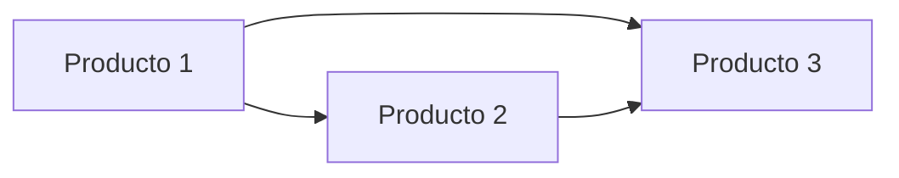

# Product Structure — [Nombre del Proyecto]

## Productos / Componentes

| # | Producto | Descripción | Team sugerido | Lead | Initiative |
|---|----------|-------------|---------------|------|------------|
| 1 | [Nombre del producto] | [Descripción breve] | [Team — confirmar con usuario] | [Asignado o TBD] | [Initiative o N/A] |
| 2 | [Nombre del producto] | [Descripción breve] | [Team — confirmar con usuario] | [Asignado o TBD] | [Initiative o N/A] |

> **Nota (ADR-005):** Cada producto = 1 Linear Project con nombre "[Producto] — Morelos".

## Dependencias entre productos

[Describir dependencias clave entre productos. Qué producto debe completarse
o avanzar antes que otro.]

## Initiatives (ADR-009)

| Initiative | Productos incluidos |
|------------|---------------------|
| [Nombre de initiative] | [Lista de productos] |

Initiatives temáticas disponibles:
- Trámites Digitales
- Datos y Core Platform
- Servicios Ciudadanos
- [Otra — crear si es necesario]

## Notas

- Los Teams deben ser confirmados por el usuario antes de crear Projects en Linear (ADR-004)
- Cada producto se documenta primero en TM bajo `Linear/[Producto]/` y después se crea en Linear
- Si un producto tiene un solo entregable, puede no necesitar sub-issues (ADR-007)

---
Generado con AI (tecnologia-morelos-workflow v0.1.0), revisado por [nombre]
