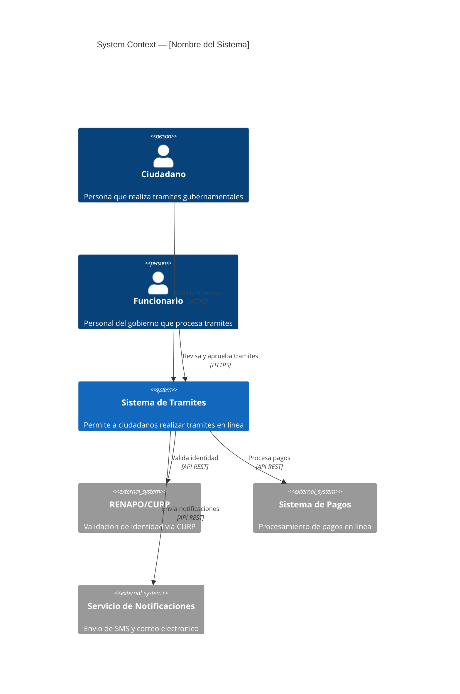
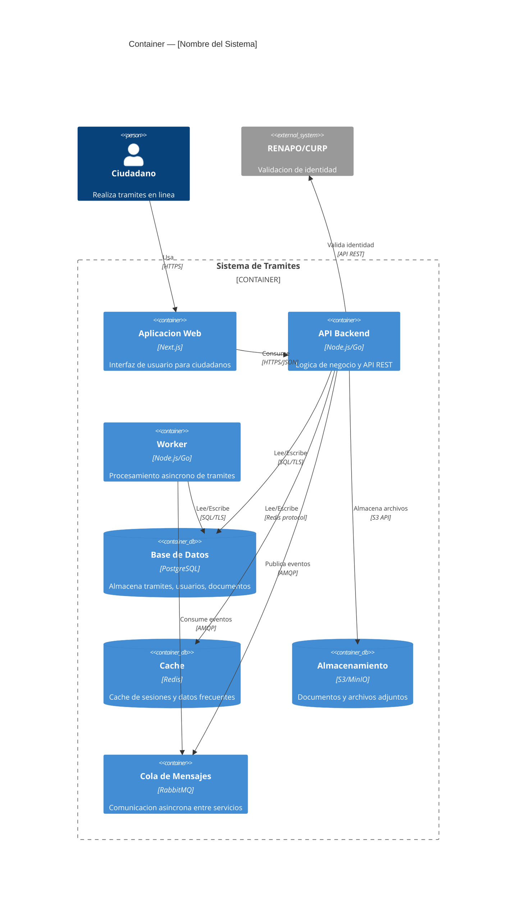
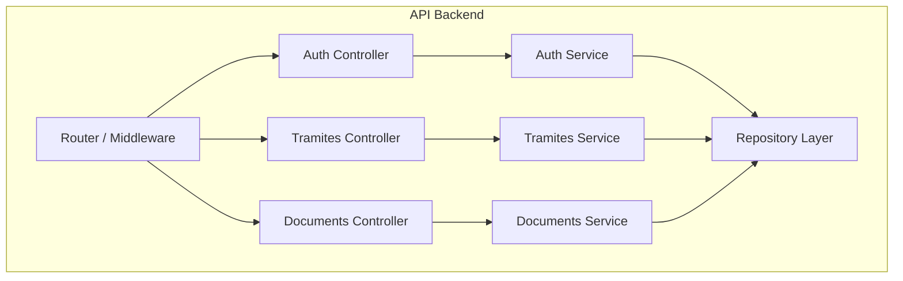

# C4 Diagrams with Mermaid — Guide

## Overview

C4 model provides four levels of abstraction for software architecture.
This guide covers **Context** and **Container** levels using Mermaid's C4 syntax.

## C4 Context Diagram

Shows the system in scope and its relationships with external actors and systems.

### Syntax

### Elements

| Element | Syntax | Use |
|---------|--------|-----|
| Person | `Person(id, "Name", "Desc")` | Human users |
| System | `System(id, "Name", "Desc")` | System in scope |
| External System | `System_Ext(id, "Name", "Desc")` | External systems |
| Relationship | `Rel(from, to, "Label", "Tech")` | Interactions |

### Government project patterns

Always include these actors where applicable:
- **Ciudadano** — end user requesting services
- **Funcionario** — government employee processing requests
- **Administrador** — system admin
- External: **RENAPO/CURP**, **SAT**, **Firma electronica**, **Payment gateway**

## C4 Container Diagram

Shows the internal containers (applications, databases, etc.) within the system.

### Syntax

### Elements

| Element | Syntax | Use |
|---------|--------|-----|
| Container | `Container(id, "Name", "Tech", "Desc")` | Application/service |
| Container DB | `ContainerDb(id, "Name", "Tech", "Desc")` | Database/store |
| Container Queue | `ContainerQueue(id, "Name", "Tech", "Desc")` | Message queue |
| Boundary | `Container_Boundary(id, "Name") { ... }` | System boundary |

## Best practices

1. **One system per diagram** — don't mix multiple systems in scope
2. **Limit to 10-15 elements** — split if needed
3. **Use clear labels** — especially for relationships (verb + protocol)
4. **External systems outside boundary** — keep the visual distinction clear
5. **Consistent naming** — use the same names in Context and Container diagrams

## Mermaid C4 limitations

- No C4 Component or Code level support (use regular flowcharts instead)
- Limited styling options compared to dedicated C4 tools
- Boundary nesting is limited to one level
- Large diagrams may render poorly — keep element count low
- Always validate with `mermaid_validate` before publishing

## Fallback: Flowchart for C4 Component

When you need a Component-level diagram, use a standard flowchart:

---
Generado con AI (tecnologia-morelos-workflow v0.1.0), revisado por [nombre]
