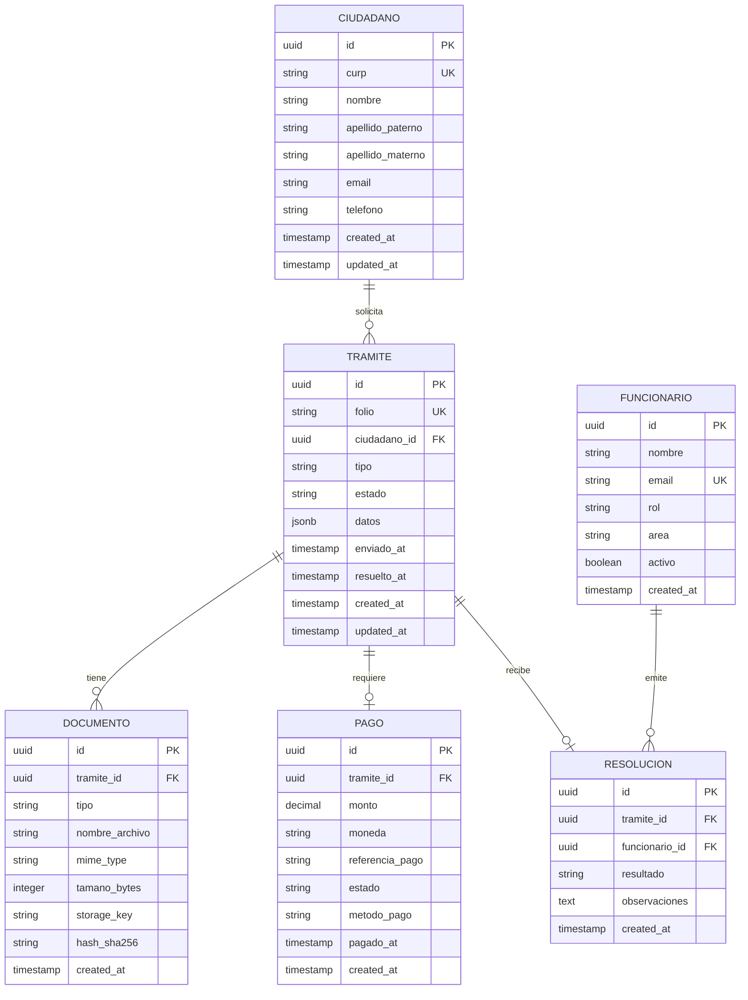

# ERD Diagrams with Mermaid — Guide

## Overview

Entity-Relationship Diagrams (ERDs) visualize the data model — entities, their attributes,
and how they relate to each other. Use Mermaid's `erDiagram` syntax.

## Basic syntax



## Relationship types

| Syntax | Meaning | Example |
|--------|---------|---------|
| `\|\|--o{` | One to many | Ciudadano has many Tramites |
| `\|\|--\|\|` | One to one | Tramite has one Resolucion |
| `\|\|--o\|` | One to zero or one | Tramite may have one Pago |
| `}o--o{` | Many to many | (use junction table instead) |
| `\|o--o{` | Zero or one to many | Optional parent |

### Notation reference

| Symbol | Meaning |
|--------|---------|
| `\|\|` | Exactly one |
| `o\|` | Zero or one |
| `}o` | Zero or many |
| `}{` | One or many |
| `o{` | Zero or many |

## Attribute markers

| Marker | Meaning |
|--------|---------|
| `PK` | Primary Key |
| `FK` | Foreign Key |
| `UK` | Unique Key |

## Government data model patterns

### Common entities

- **Ciudadano**: Always includes CURP as unique identifier
- **Tramite**: Core entity — has folio, tipo, estado, lifecycle timestamps
- **Documento**: Attached files — include hash for integrity
- **Pago**: Payment records — amount, reference, status
- **Funcionario**: Government employees — role and area
- **Resolucion**: Decision on a tramite — result and observations
- **Bitacora/AuditLog**: Track all changes for accountability

### Common relationships

```
Ciudadano  →  Tramite       (1:N — one citizen, many tramites)
Tramite    →  Documento     (1:N — one tramite, many documents)
Tramite    →  Pago          (1:0..1 — optional payment)
Tramite    →  Resolucion    (1:0..1 — optional resolution)
Funcionario →  Resolucion   (1:N — one official, many resolutions)
Tramite    →  Bitacora      (1:N — audit trail)
```

### State machines

Tramite states typically follow:

```
borrador → enviado → en_revision → [aprobado | rechazado | requiere_correccion]
                                      ↓
                                   completado
```

Include this as a note or separate state diagram.

## Best practices

1. **Group related entities** — keep the diagram readable by grouping
2. **Limit to 8-12 entities per diagram** — split into domain sub-diagrams if larger
3. **Include key attributes only** — not every column, focus on PK, FK, UK, and business-critical fields
4. **Use consistent naming** — snake_case for attributes, UPPER_CASE for entity names
5. **Show relationship labels** — use verbs that describe the business meaning
6. **Include timestamps** — `created_at` and `updated_at` are standard
7. **UUID for IDs** — preferred over auto-increment for distributed systems

## Splitting large models

For projects with 15+ entities, split into sub-diagrams:

1. **Core domain** — Ciudadano, Tramite, Documento, Pago
2. **Administrative** — Funcionario, Area, Resolucion, Bitacora
3. **Configuration** — TipoTramite, Catalogo, Configuracion
4. **Authentication** — Usuario, Rol, Permiso, Sesion

Each sub-diagram should be a separate page in TM.

---
Generado con AI (tecnologia-morelos-workflow v0.1.0), revisado por [nombre]
